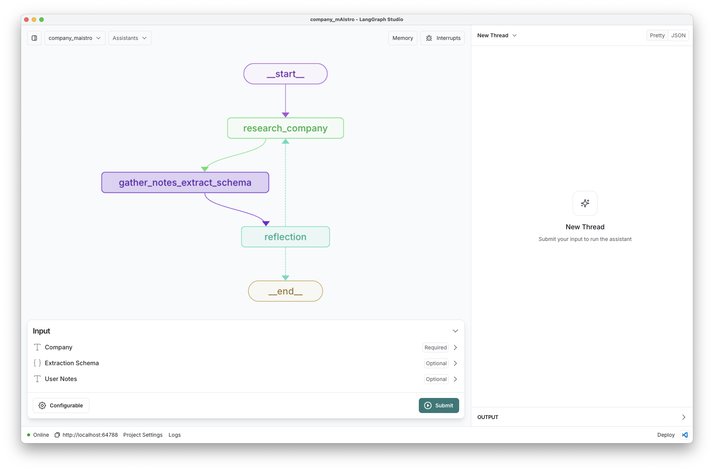
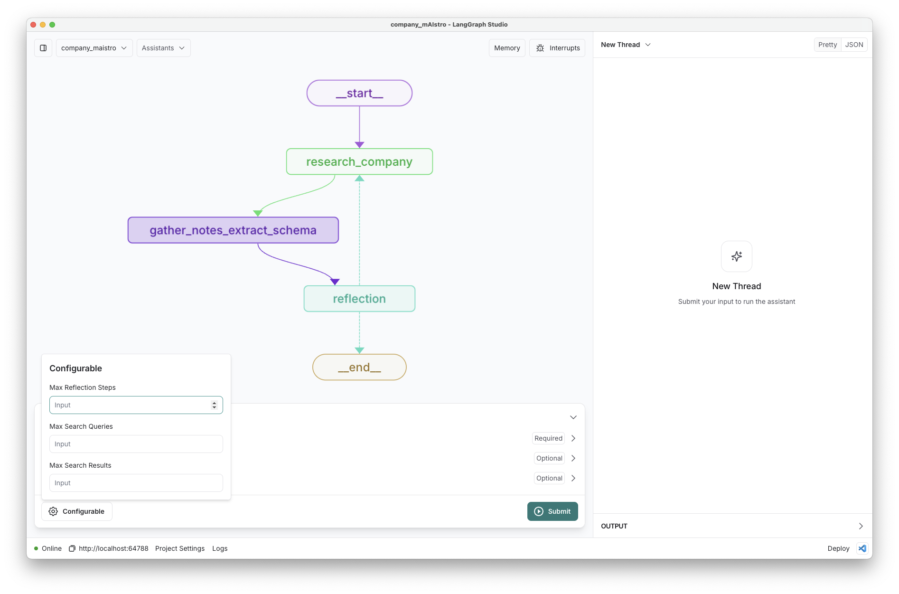

# Company mAIstro

Company mAIstro researches information about a user-supplied company, and returns it in any user-defined schema.

## Quickstart

1. Populate the `.env` file: 
```
$ cp .env.example .env
```

2. Load this folder in [LangGraph Studio](https://github.com/langchain-ai/langgraph-studio?tab=readme-ov-file#download) 

3. Provide a schema for the output, and pass in a company name. 

4. Run the graph just inputting a `company` name.

* A schema (see below for details) is optional. It will use a default schema defined [here](https://github.com/langchain-ai/company_mAIstro/blob/main/company_maistro.py#L163) if none is provided.
* Additional user notes about the company can be provided as a text field, and will be included in the research process. 

      

## Overview

Company mAIstro follows a multi-step research and extraction workflow that separates web research from schema extraction, allowing for better resource management and comprehensive data collection:

   - **Research Phase**: The system performs intelligent web research on the input company:
     - Uses an LLM to generate targeted search queries based on the schema requirements (up to `max_search_queries` per company)
     - Executes concurrent web searches via [Tavily API](https://tavily.com/), retrieving up to `max_search_results` results per query
     - Takes structured research notes focused on schema-relevant information
   - **Extraction Phase**: After research is complete, the system:
     - Consolidates all research notes
     - Uses an LLM to extract and format the information according to the user-defined schema
     - Returns the structured data in the exact format requested
   - **Reflection Phase**: The system evaluates the quality of extracted information:
     - Analyzes completeness of required fields
     - Identifies any missing or incomplete information
     - Generates targeted follow-up search queries if needed
     - Continues research until information is satisfactory or max reflection steps reached

## Configuration

The configuration for Company mAIstro is defined in the `configuration.py` file: 
* `max_search_queries`: int = 3 # Max search queries per company
* `max_search_results`: int = 3 # Max search results per query
* `max_reflection_steps`: int = 1 # Max reflection steps

These can be added in Studio:



## Inputs 

The user inputs are: 

```
* company: str - A company to research
* schema: Optional[dict] - A JSON schema for the output
* user_notes: Optional[str] - Any additional notes about the company from the user
```

If a schema is not provided, the system will use a default schema (`DEFAULT_EXTRACTION_SCHEMA`) defined in `company_maistro.py`.

### Schemas  

> ⚠️ **WARNING:** JSON schemas require `title` and `description` fields for [extraction](https://python.langchain.com/docs/how_to/structured_output/#typeddict-or-json-schema).
> ⚠️ **WARNING:** Avoid JSON objects with nesting; LLMs have challenges performing structured extraction from nested objects. See examples below that we have tested. 

Here is an example schema that can be supplied to research a company:  

* See the trace [here](https://smith.langchain.com/public/9f51fb8b-9486-4cd2-90ed-895f7932304e/r).

```
{
    "title": "CompanyInfo",
    "description": "Basic information about a company",
    "type": "object",
    "properties": {
        "company_name": {
            "type": "string",
            "description": "Official name of the company"
        },
        "founding_year": {
            "type": "integer",
            "description": "Year the company was founded"
        },
        "founder_names": {
            "type": "array",
            "items": {"type": "string"},
            "description": "Names of the founding team members"
        },
        "product_description": {
            "type": "string",
            "description": "Brief description of the company's main product or service"
        },
        "funding_summary": {
            "type": "string",
            "description": "Summary of the company's funding history"
        }
    },
    "required": ["company_name"]
}
```

Here is an example of a more complex schema: 

* See the reflections steps in the trace [here](https://smith.langchain.com/public/36f0d917-4edd-4d55-8dbf-6d6ec8a25754/r).

```
HARD_EXTRACTION_SCHEMA = {
    "title": "CompanyInfo",
    "description": "Comprehensive information about a company with confidence tracking",
    "type": "object",
    "properties": {
        "company_name": {
            "type": "string",
            "description": "Official name of the company"
        },
        "verified_company": {
            "type": "boolean",
            "description": "Confirmation this is the intended company, not a similarly named one"
        },
        "similar_companies": {
            "type": "array",
            "items": {"type": "string"},
            "description": "List of similarly named companies that could be confused with the target"
        },
        "distinguishing_features": {
            "type": "string",
            "description": "Key features that distinguish this company from similarly named ones"
        },
        "key_executives": {
            "type": "array",
            "items": {
                "type": "object",
                "properties": {
                    "name": {"type": "string"},
                    "title": {"type": "string"},
                    "verification_date": {"type": "string"},
                    "confidence_level": {
                        "type": "string",
                        "enum": ["high", "medium", "low", "uncertain"]
                    },
                    "source": {"type": "string"}
                }
            }
        },
        "org_chart_summary": {
            "type": "string",
            "description": "Brief description of organizational structure"
        },
        "leadership_caveats": {
            "type": "string",
            "description": "Any uncertainties or caveats about leadership information"
        },
        "main_products": {
            "type": "array",
            "items": {
                "type": "object",
                "properties": {
                    "name": {"type": "string"},
                    "description": {"type": "string"},
                    "launch_date": {"type": "string"},
                    "current_status": {"type": "string"}
                }
            }
        },
        "services": {
            "type": "array",
            "items": {
                "type": "object",
                "properties": {
                    "name": {"type": "string"},
                    "description": {"type": "string"},
                    "target_market": {"type": "string"}
                }
            }
        },
        "recent_developments": {
            "type": "array",
            "items": {
                "type": "object",
                "properties": {
                    "date": {"type": "string"},
                    "title": {"type": "string"},
                    "summary": {"type": "string"},
                    "source_url": {"type": "string"},
                    "significance": {"type": "string"}
                }
            },
            "description": "Major news and developments from the last 6 months"
        },
        "historical_challenges": {
            "type": "array",
            "items": {
                "type": "object",
                "properties": {
                    "issue_type": {"type": "string"},
                    "description": {"type": "string"},
                    "date_period": {"type": "string"},
                    "resolution": {"type": "string"},
                    "current_status": {"type": "string"}
                }
            },
            "description": "Past challenges, issues, or controversies"
        },
        "sources": {
            "type": "array",
            "items": {
                "type": "object",
                "properties": {
                    "url": {"type": "string"},
                    "title": {"type": "string"},
                    "date_accessed": {"type": "string"},
                    "information_type": {
                        "type": "array",
                        "items": {"type": "string"},
                        "description": "Types of information sourced from this link (e.g., leadership, products, news)"
                    }
                }
            }
        },
        "company_summary": {
            "type": "string",
            "description": "Concise, dense summary of the most important company information (max 250 words)"
        }
    },
    "required": [
        "company_name",
        "verified_company",
        "company_summary",
        "key_executives",
        "main_products",
        "sources"
    ]
}
```

## Evaluation

Please see instructions on how to run evals [here](https://github.com/langchain-ai/agent-evals/tree/main/public_company_data_enrichment) and [here](https://github.com/langchain-ai/agent-evals/tree/main/startup_data_enrichment).